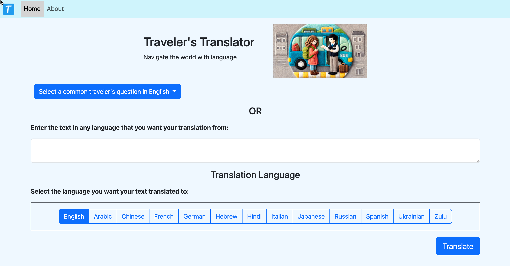
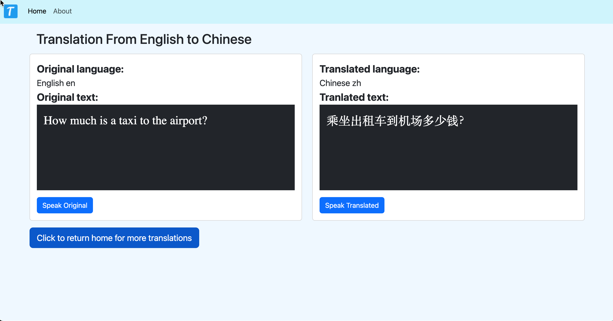
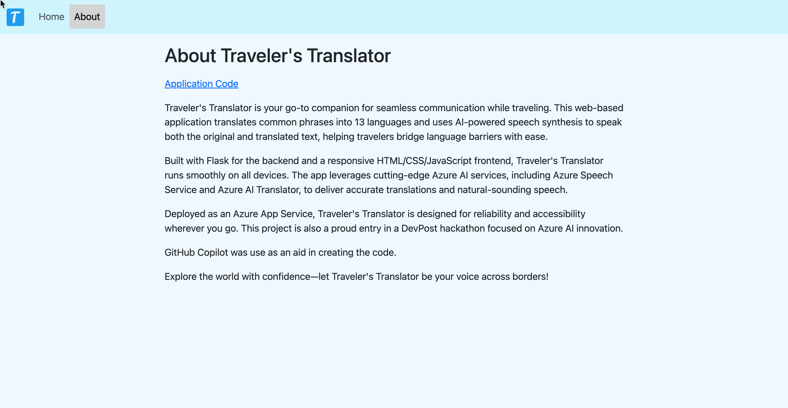

# FlaskTranslator App

This app uses Azure Speech Services, AI Translator, and App Services to run
a Flask web application.  
The user can choose from a list of common traveler's questions in English to be tranlated to 1 of 13 languages.  Alternatively, the user can type in text
in any language and Azure will determine which language it is.  Finally the 
user choose a language to tranlate to and presses the Translate button.

The Result page shows the orginal language and the translated language. The user
can also press a button to hear the language spoken.

  

  




[Application URL](https://flasktranslatorapp-bvepdbcvgmh7ffek.westus2-01.azurewebsites.net)

## Flask Local Development Server
```commandline
export FLASK_ENV=development
flask run
```

## Microsoft Python SDK on MAC
brew update && brew install azure-cli

## Azure Setup

### Text Translation

Apply Azure subscription to AI Services translator resource group.  You'll then be able to 
get key and cloud region so you can make a call to the API. 

[Text Translation](https://learn.microsoft.com/en-us/azure/ai-services/translator/text-translation/overview)

### Speech Service for Speech Synthesis 

Apply Azure subscription to Azure AI Speech Service resource group. You'll get a speech key 
and cloud region.

[Text to Speech](https://learn.microsoft.com/en-us/azure/ai-services/speech-service/index-text-to-speech)  


## Get Key  

Install the Azure CLI to get listing of keys per resource group.
az cognitiveservices account keys list --resource-group <your-resource-group-name> --name <your-resource-name>

az cognitiveservices account keys list --resource-group TranslatorAI --name bplangtrans

## Azure App Service

Apply subscription to set up app service.

deploy: az webapp up --runtime PYTHON:3.13 --sku F1 --logs

You can deploy from the command line or use the portal.  Here are instructions for the portal:

To run a Flask application on Azure using the Azure UI, you'll typically deploy it as a web app, and you'll configure the startup command within the Azure portal, rather than directly entering commands in the UI. 
Here's a breakdown of the process:
1. Create an App Service (Web App) in Azure:
Navigate to the Azure portal and search for "App Services".
Select "App Services" and then click "+ Create" followed by "+ Web App".
Fill in the required details, including:
Resource Group: Select an existing or create a new one.
Name: Choose a unique name for your app.
Runtime Stack: Select "Python" and the desired Python version (e.g., 3.9).
Region: Choose an Azure region near you. 
2. Deploy Your Flask Application:
Method 1: Deploy from a Repository (Recommended):
Choose a deployment method like "Source Control" (e.g., GitHub) and link it to your repository containing your Flask application. 
Azure will automatically build and deploy your application based on the configuration in your repository. 
Method 2: Deploy Manually (Kudu Console):
Use the "Kudu" console (accessible within your App Service) to upload your application files. 
You'll need to ensure your Flask application is packaged with the necessary dependencies (e.g., requirements.txt). 
3. Configure Startup Command (in Azure Portal):
Navigate to your App Service in the Azure portal. 
Go to "Configuration" -> "General settings". 
Find the "Startup Command" field and enter the command to run your Flask application. 
A common command is: flask run --app <your_app_file> --host 0.0.0.0 --port 80 (replace <your_app_file> with the name of your Flask app file, e.g., app.py). 
You can also use gunicorn for production deployment: gunicorn --bind=0.0.0.0:80 --timeout 600 <your_app_file>:app. 
Save the changes. 
4. Access Your Application:
Once deployed, you can access your Flask application through the URL provided by Azure. 
Example:
Let's say your Flask app is in a file named app.py. You would configure the startup command as:
Code

flask run --app app.py --host 0.0.0.0 --port 80
Important Notes:
Dependencies:
Ensure your requirements.txt file contains all necessary Flask dependencies. 
Port:
Azure App Service typically uses port 80 for HTTP traffic, so you might need to configure your Flask application to listen on that port. 
Error Handling:
Monitor the application logs in the Azure portal to troubleshoot any issues during deployment or startup. 
Containerization (Optional):
For more complex applications, you can containerize your Flask application using Docker and deploy it to Azure Container Apps or App Service on Linux. 

## Deployment from Command Line
    az webapp up --name <app-name> --resource-group <resource-group-name> --deployment-container-image-name <container-image-name>  --sku B1 --runtime <runtime-stack> --location <location> 

## Requirements Text

```
flask
python-env
requests
python-dotenv
azure-ai-translation-text
azure-cognitiveservices-speech``
```
